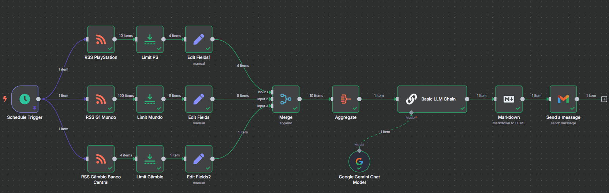

<h1 align="center">Automated NewsLetter N8N 📰</h1>

 AI-powered automation for turning RSS feeds into a well-structured Real-Time Briefing (RTB). Uses Google Gemini for summarization, Markdown for formatting, and n8n for workflow orchestration.

  

  
  <a href="#-screenshots">Screenshots</a>&nbsp;&nbsp;&nbsp;|&nbsp;&nbsp;&nbsp;
  <a href="#-overview">Overview</a>&nbsp;&nbsp;&nbsp;|&nbsp;&nbsp;&nbsp;
  <a href="#-tools">Tools</a>&nbsp;&nbsp;&nbsp;|&nbsp;&nbsp;&nbsp;
  <a href="#-how-to-run">How to Run</a>&nbsp;&nbsp;&nbsp;|&nbsp;&nbsp;&nbsp;
  <a href="#-project">Project</a>&nbsp;&nbsp;&nbsp;|&nbsp;&nbsp;&nbsp;
  <a href="#-license">License</a>&nbsp;&nbsp;&nbsp;|&nbsp;&nbsp;&nbsp;
  <a href="#-contributing">Contributing</a>&nbsp;&nbsp;&nbsp;|&nbsp;&nbsp;&nbsp;
  <a href="#support">Support</a>  

 

## 📸 Screenshots

 

## 🔗 Overview

1. **Schedule Trigger:** Defines when the workflow runs (e.g., daily at 7 AM).
2. **RSS Feeds:** Collects data from:
   - PlayStation News
   - G1 Mundo (World News)
   - Central Bank Exchange Rates
3. **Limit & Edit Fields:** Filters and formats the raw data.
4. **Merge + Aggregate:** Combines all data into a single digest.
5. **Basic LLM Chain:** Uses Google Gemini to summarize the aggregated content.
6. **Markdown to HTML:** Converts markdown text to HTML for email formatting.
7. **Send Message:** Sends the newsletter via Gmail.

 

## 🛠 Tools

- [n8n](https://n8n.io/) – Automation workflow tool
- [RSS Feeds](https://en.wikipedia.org/wiki/RSS) – Data sources
- [Google Gemini API](https://cloud.google.com/vertex-ai/docs/generative-ai) – AI summarization
- Markdown → HTML parser
- Gmail API – Email delivery

 

## ⚙ How to Run

1. Install [n8n](https://docs.n8n.io/hosting/installation/).
2. Import the workflow JSON file (`Simple_Newsletter.json`).
3. Set up your credentials:
   - Google Gemini API Key
   - Gmail account for email delivery
4. Customize your RSS feeds if needed.
5. Configure the schedule for automated execution.

 

## 💻 Project

 This project automates the collection of RSS feed data, summarizes the content using Google Gemini AI, and delivers a clean, well-structured newsletter via email. It’s designed to streamline information from multiple sources into a concise RTB (Real-Time Briefing). It also uses a prompt based on the PRINCE methodology to ensure clarity, conciseness, and a professional tone in the generated content.

 

## 📜 License

* This project is licensed under the [MIT License](https://choosealicense.com/licenses/mit/)

 

## 🫱🏻‍🫲🏻 Contributing

 Contributions, issues, and feature requests are welcome! Please, feel free to do it! 😉 

 

## 🌟 Support

 If you like this project, please give it a star ⭐ and share it with others! 😄 

